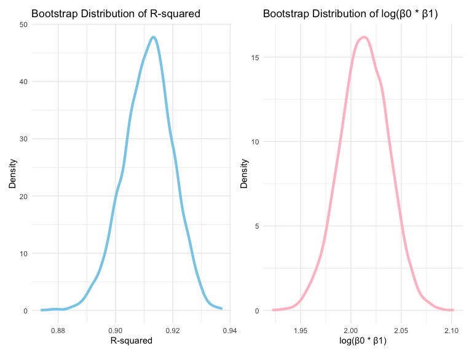
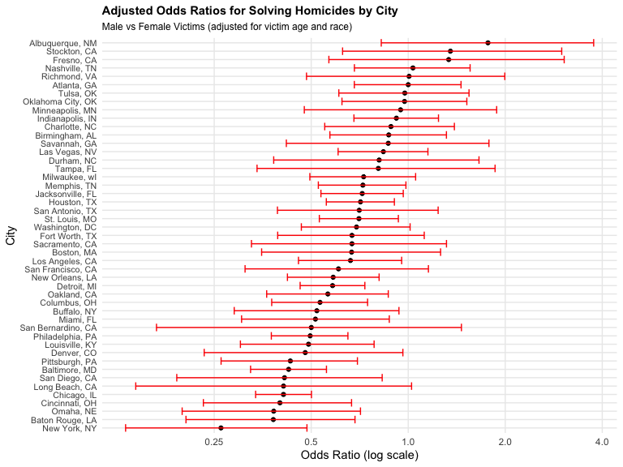
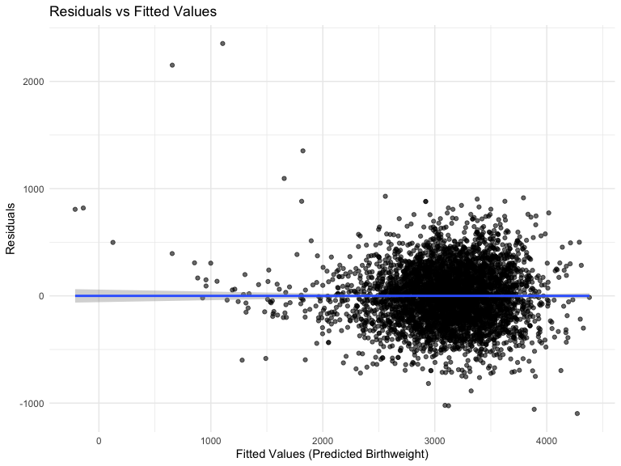
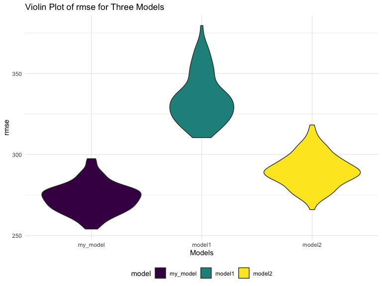

P8105_hw6_yc4588
================
Yining Cao
2024-11-19

### Problem 1

#### Read the data

``` r
weather_df = 
  rnoaa::meteo_pull_monitors(
    c("USW00094728"),
    var = c("PRCP", "TMIN", "TMAX"), 
    date_min = "2017-01-01",
    date_max = "2017-12-31") |>
  mutate(
    name = recode(id, USW00094728 = "CentralPark_NY"),
    tmin = tmin / 10,
    tmax = tmax / 10) |>
  select(name, id, everything())
```

#### Distribution of 2 estimates(r-squared and log(β0 \* β1)

``` r
boot_regression = function(data, indices) {
  boot_sample = data[indices, ]
  
  boot_model = lm(tmax ~ tmin, data = boot_sample)
  
  r_squared = broom::glance(boot_model)$r.squared
  
  coef_df = broom::tidy(boot_model)
  
  log_coef_product = log(coef_df$estimate[1] * coef_df$estimate[2])
  
  return(c(r_squared = r_squared, 
           log_coef_product = log_coef_product))
}

n_boot = 5000
boot_results = replicate(
  n_boot, 
  boot_regression(weather_df, sample(nrow(weather_df), replace = TRUE))
)

boot_df = as.data.frame(t(boot_results))

p1 = ggplot(boot_df, aes(x = r_squared)) +
  geom_line(stat = "density", color = "skyblue", size = 1.5) +
  labs(title = "Bootstrap Distribution of R-squared",
       x = "R-squared",
       y = "Density")

p2 = ggplot(boot_df, aes(x = log_coef_product)) +
  geom_line(stat = "density", color = "pink", size = 1.5) +
  labs(title = "Bootstrap Distribution of log(β0 * β1)",
       x = "log(β0 * β1)",
       y = "Density")

p1 + p2
```



- Left plot(blue): R-squared values, bell-shaped around 0.91-0.92.  
- Right plot (pink): log(β0 \* β1), bell-shaped around 2.0.  
- Both distributions are fairly symmetric and narrow, indicating stable
  estimates.

#### Compute confidence intervals

``` r
r_squared_ci = quantile(boot_df$r_squared, c(0.025, 0.975))
log_coef_ci = quantile(boot_df$log_coef_product, c(0.025, 0.975))

cat("95% CI for R-squared: ", r_squared_ci, "\n")
```

    ## 95% CI for R-squared:  0.8936684 0.927106

``` r
cat("95% CI for log(β0 * β1): ", log_coef_ci, "\n")
```

    ## 95% CI for log(β0 * β1):  1.964949 2.058887

### Problem 2

#### Load and clean the data

``` r
homicide_df <- read.csv("homicide-data.csv", na = c("", "NA", "Unknown")) %>% 
  mutate(city_state = str_c(city, ", ", state),
         resolution = case_when(
      disposition == "Closed by arrest" ~ 1,
      disposition == "Closed without arrest" ~ 0,
      disposition == "Open/No arrest" ~ 0,
      TRUE ~ NA),
      victim_age = as.numeric(victim_age)
    ) %>%
  filter(
    !city_state %in% c("Dallas, TX", "Phoenix, AZ", "Kansas City, MO", "Tulsa, AL"),
    victim_race %in% c("White", "Black")
    )
```

#### Filter for Baltimore and fit logistic regression model

``` r
baltimore_model = homicide_df %>%
  filter(city_state == "Baltimore, MD") %>%
  glm(resolution ~ victim_age + victim_sex + victim_race, 
      data = ., 
      family = binomial())

baltimore_model_results = broom::tidy(baltimore_model, conf.int = TRUE)

knitr::kable(baltimore_model_results, digits = 3)
```

| term             | estimate | std.error | statistic | p.value | conf.low | conf.high |
|:-----------------|---------:|----------:|----------:|--------:|---------:|----------:|
| (Intercept)      |    0.310 |     0.171 |     1.810 |   0.070 |   -0.025 |     0.648 |
| victim_age       |   -0.007 |     0.003 |    -2.024 |   0.043 |   -0.013 |     0.000 |
| victim_sexMale   |   -0.854 |     0.138 |    -6.184 |   0.000 |   -1.126 |    -0.584 |
| victim_raceWhite |    0.842 |     0.175 |     4.818 |   0.000 |    0.501 |     1.187 |

#### Calculate odds ratio and CI for victim_sex (male vs female)

``` r
sex_or = baltimore_model_results %>%
  filter(term == "victim_sexMale") %>%
  mutate(
    odds_ratio = exp(estimate),
    conf_low_or = exp(conf.low),
    conf_high_or = exp(conf.high)
  ) %>%
  select(term, odds_ratio, conf_low_or, conf_high_or) 

  knitr::kable(sex_or, digits = 3 )
```

| term           | odds_ratio | conf_low_or | conf_high_or |
|:---------------|-----------:|------------:|-------------:|
| victim_sexMale |      0.426 |       0.324 |        0.558 |

#### Extract the adjusted odds ratio and CI

``` r
city_results = homicide_df %>%
  group_by(city_state) %>%
  nest() %>%
  mutate(
    models = purrr::map(data, ~glm(resolution ~ victim_age + victim_sex + victim_race, 
                          data = ., 
                          family = binomial())),
    
    tidy_result = purrr::map(models, ~tidy(., conf.int = TRUE))
  ) %>%
  select(-models) %>%
  unnest(tidy_result) %>%
  filter(term == "victim_sexMale") %>%
  mutate(
    odds_ratio = exp(estimate),
    conf_low = exp(conf.low),
    conf_high = exp(conf.high)
  ) %>%
  select(city_state, odds_ratio, conf_low, conf_high) %>%
  arrange(odds_ratio)

knitr::kable(city_results, digits = 3)
```

| city_state         | odds_ratio | conf_low | conf_high |
|:-------------------|-----------:|---------:|----------:|
| New York, NY       |      0.262 |    0.133 |     0.485 |
| Baton Rouge, LA    |      0.381 |    0.204 |     0.684 |
| Omaha, NE          |      0.382 |    0.199 |     0.711 |
| Cincinnati, OH     |      0.400 |    0.231 |     0.667 |
| Chicago, IL        |      0.410 |    0.336 |     0.501 |
| Long Beach, CA     |      0.410 |    0.143 |     1.024 |
| San Diego, CA      |      0.413 |    0.191 |     0.830 |
| Baltimore, MD      |      0.426 |    0.324 |     0.558 |
| Pittsburgh, PA     |      0.431 |    0.263 |     0.696 |
| Denver, CO         |      0.479 |    0.233 |     0.962 |
| Louisville, KY     |      0.491 |    0.301 |     0.784 |
| Philadelphia, PA   |      0.496 |    0.376 |     0.650 |
| San Bernardino, CA |      0.500 |    0.166 |     1.462 |
| Miami, FL          |      0.515 |    0.304 |     0.873 |
| Buffalo, NY        |      0.521 |    0.288 |     0.936 |
| Columbus, OH       |      0.532 |    0.377 |     0.748 |
| Oakland, CA        |      0.563 |    0.364 |     0.867 |
| Detroit, MI        |      0.582 |    0.462 |     0.734 |
| New Orleans, LA    |      0.585 |    0.422 |     0.812 |
| San Francisco, CA  |      0.608 |    0.312 |     1.155 |
| Los Angeles, CA    |      0.662 |    0.457 |     0.954 |
| Boston, MA         |      0.667 |    0.351 |     1.260 |
| Sacramento, CA     |      0.669 |    0.326 |     1.314 |
| Fort Worth, TX     |      0.669 |    0.394 |     1.121 |
| Washington, DC     |      0.691 |    0.466 |     1.014 |
| St. Louis, MO      |      0.703 |    0.530 |     0.932 |
| San Antonio, TX    |      0.705 |    0.393 |     1.238 |
| Houston, TX        |      0.711 |    0.557 |     0.906 |
| Jacksonville, FL   |      0.720 |    0.536 |     0.965 |
| Memphis, TN        |      0.723 |    0.526 |     0.984 |
| Milwaukee, wI      |      0.727 |    0.495 |     1.054 |
| Tampa, FL          |      0.808 |    0.340 |     1.860 |
| Durham, NC         |      0.812 |    0.382 |     1.658 |
| Las Vegas, NV      |      0.837 |    0.606 |     1.151 |
| Savannah, GA       |      0.867 |    0.419 |     1.780 |
| Birmingham, AL     |      0.870 |    0.571 |     1.314 |
| Charlotte, NC      |      0.884 |    0.551 |     1.391 |
| Indianapolis, IN   |      0.919 |    0.678 |     1.241 |
| Minneapolis, MN    |      0.947 |    0.476 |     1.881 |
| Oklahoma City, OK  |      0.974 |    0.623 |     1.520 |
| Tulsa, OK          |      0.976 |    0.609 |     1.544 |
| Atlanta, GA        |      1.000 |    0.680 |     1.458 |
| Richmond, VA       |      1.006 |    0.483 |     1.994 |
| Nashville, TN      |      1.034 |    0.681 |     1.556 |
| Fresno, CA         |      1.335 |    0.567 |     3.048 |
| Stockton, CA       |      1.352 |    0.626 |     2.994 |
| Albuquerque, NM    |      1.767 |    0.825 |     3.762 |

#### A plot that shows the estimated ORs and CIs for each city

``` r
ggplot(city_results, 
       aes(x = odds_ratio, 
           y = fct_reorder(city_state, odds_ratio))) +
  geom_point(size = 1.5) +
  geom_errorbar(aes(xmin = conf_low, xmax = conf_high), color = "red") + 
  # Use log scale for better ratio visualization
  scale_x_continuous(trans = "log",
                    breaks = c(0.25, 0.5, 1.0, 2.0, 4.0),
                    labels = c("0.25", "0.5", "1.0", "2.0", "4.0")) +
  labs(
    title = "Adjusted Odds Ratios for Solving Homicides by City",
    subtitle = "Male vs Female Victims (adjusted for victim age and race)",
    x = "Odds Ratio (log scale)",
    y = "City"
  ) +
  theme_minimal() +
  theme(
    panel.grid.minor = element_blank(),
    plot.title = element_text(size = 11, face = "bold"),
    plot.subtitle = element_text(size = 9),
    axis.text.y = element_text(size = 8)
  )
```

 1.
Most cities show odds ratios below 1.0, indicating that homicides with
female victims are generally more likely to be solved than those with
male victims.  
2. Cities range roughly from:  
- Highest: Albuquerque and Stockton (OR ~2.0).  
- Lowest: New York and Baton Rouge (OR ~0.3-0.4).  
3. The horizontal lines represent confidence intervals:  
- Longer lines indicate more uncertainty:  
- Some cities (like San Bernardino) show very wide confidence intervals,
suggesting less reliable estimates.  
- Others (like Houston and Jacksonville) have narrower intervals,
indicating more precise estimates.

This pattern might suggest systemic differences in how homicides are
investigated or solved based on victim gender, though the specific
factors driving these differences would require additional analysis to
understand.

### Problem 3

#### Load and check the data

``` r
birthweight_df <- read_csv("birthweight.csv")

colSums(is.na(birthweight_df))
```

    ##  babysex    bhead  blength      bwt    delwt  fincome    frace  gaweeks 
    ##        0        0        0        0        0        0        0        0 
    ##  malform menarche  mheight   momage    mrace   parity  pnumlbw  pnumsga 
    ##        0        0        0        0        0        0        0        0 
    ##    ppbmi     ppwt   smoken   wtgain 
    ##        0        0        0        0

``` r
str(birthweight_df)
```

    ## spc_tbl_ [4,342 × 20] (S3: spec_tbl_df/tbl_df/tbl/data.frame)
    ##  $ babysex : num [1:4342] 2 1 2 1 2 1 2 2 1 1 ...
    ##  $ bhead   : num [1:4342] 34 34 36 34 34 33 33 33 36 33 ...
    ##  $ blength : num [1:4342] 51 48 50 52 52 52 46 49 52 50 ...
    ##  $ bwt     : num [1:4342] 3629 3062 3345 3062 3374 ...
    ##  $ delwt   : num [1:4342] 177 156 148 157 156 129 126 140 146 169 ...
    ##  $ fincome : num [1:4342] 35 65 85 55 5 55 96 5 85 75 ...
    ##  $ frace   : num [1:4342] 1 2 1 1 1 1 2 1 1 2 ...
    ##  $ gaweeks : num [1:4342] 39.9 25.9 39.9 40 41.6 ...
    ##  $ malform : num [1:4342] 0 0 0 0 0 0 0 0 0 0 ...
    ##  $ menarche: num [1:4342] 13 14 12 14 13 12 14 12 11 12 ...
    ##  $ mheight : num [1:4342] 63 65 64 64 66 66 72 62 61 64 ...
    ##  $ momage  : num [1:4342] 36 25 29 18 20 23 29 19 13 19 ...
    ##  $ mrace   : num [1:4342] 1 2 1 1 1 1 2 1 1 2 ...
    ##  $ parity  : num [1:4342] 3 0 0 0 0 0 0 0 0 0 ...
    ##  $ pnumlbw : num [1:4342] 0 0 0 0 0 0 0 0 0 0 ...
    ##  $ pnumsga : num [1:4342] 0 0 0 0 0 0 0 0 0 0 ...
    ##  $ ppbmi   : num [1:4342] 26.3 21.3 23.6 21.8 21 ...
    ##  $ ppwt    : num [1:4342] 148 128 137 127 130 115 105 119 105 145 ...
    ##  $ smoken  : num [1:4342] 0 0 1 10 1 0 0 0 0 4 ...
    ##  $ wtgain  : num [1:4342] 29 28 11 30 26 14 21 21 41 24 ...
    ##  - attr(*, "spec")=
    ##   .. cols(
    ##   ..   babysex = col_double(),
    ##   ..   bhead = col_double(),
    ##   ..   blength = col_double(),
    ##   ..   bwt = col_double(),
    ##   ..   delwt = col_double(),
    ##   ..   fincome = col_double(),
    ##   ..   frace = col_double(),
    ##   ..   gaweeks = col_double(),
    ##   ..   malform = col_double(),
    ##   ..   menarche = col_double(),
    ##   ..   mheight = col_double(),
    ##   ..   momage = col_double(),
    ##   ..   mrace = col_double(),
    ##   ..   parity = col_double(),
    ##   ..   pnumlbw = col_double(),
    ##   ..   pnumsga = col_double(),
    ##   ..   ppbmi = col_double(),
    ##   ..   ppwt = col_double(),
    ##   ..   smoken = col_double(),
    ##   ..   wtgain = col_double()
    ##   .. )
    ##  - attr(*, "problems")=<externalptr>

``` r
sum(!complete.cases(birthweight_df))
```

    ## [1] 0

#### Clean the data

``` r
birthweight_df <- birthweight_df %>%
 mutate(babysex = recode(babysex, "1" = "male", "2" = "female"),
         frace = recode(frace, "1" = "White", "2" = "Black", "3" = "Asian", "4" = "Puerto Rican", "8" = "Other", "9" = "Unknown"),
         malform = recode(malform, "0" = "absent", "1" = "present"),
         mrace = recode(mrace, "1" = "White", "2" = "Black", "3" = "Asian", "4" = "Puerto Rican", "8" = "Other")) %>% 
  mutate(
    babysex = factor(babysex),
    frace = factor(frace),
    malform = factor(malform),
    mrace = factor(mrace)
  )
```

#### Fit a regression model for birthweight

``` r
my_model <- lm(bwt ~ ., data = birthweight_df) %>% 
  step(direction = "backward", trace = 0) 

model_results = my_model %>% 
  broom::tidy() %>% 
  knitr::kable(digits = 5)

model_results
```

| term              |    estimate | std.error | statistic | p.value |
|:------------------|------------:|----------:|----------:|--------:|
| (Intercept)       | -6145.15067 | 141.94965 | -43.29106 | 0.00000 |
| babysexmale       |   -28.55802 |   8.45490 |  -3.37769 | 0.00074 |
| bhead             |   130.77704 |   3.44657 |  37.94414 | 0.00000 |
| blength           |    74.94711 |   2.01905 |  37.12003 | 0.00000 |
| delwt             |     4.10673 |   0.39206 |  10.47478 | 0.00000 |
| fincome           |     0.31802 |   0.17475 |   1.81990 | 0.06884 |
| gaweeks           |    11.59249 |   1.46207 |   7.92884 | 0.00000 |
| mheight           |     6.59404 |   1.78488 |   3.69438 | 0.00022 |
| mraceBlack        |   -63.90570 |  42.36626 |  -1.50841 | 0.13152 |
| mracePuerto Rican |   -25.79137 |  45.35015 |  -0.56872 | 0.56958 |
| mraceWhite        |    74.88678 |  42.31463 |   1.76976 | 0.07684 |
| parity            |    96.30469 |  40.33622 |   2.38755 | 0.01700 |
| ppwt              |    -2.67559 |   0.42736 |  -6.26075 | 0.00000 |
| smoken            |    -4.84342 |   0.58558 |  -8.27121 | 0.00000 |

#### Plot residuals vs fitted values

``` r
birthweight_df = birthweight_df %>%
  add_predictions(my_model) %>%
  add_residuals(my_model)

ggplot(birthweight_df, aes(x = pred, y = resid)) +
  geom_point(alpha = 0.6) +
  geom_smooth(method = "lm") + 
  labs(
    title = "Residuals vs Fitted Values",
    x = "Fitted Values (Predicted Birthweight)",
    y = "Residuals"
  ) +
  theme_minimal()
```



- The modeling process involved fitting an initial full regression model
  with all hypothesized predictors of birthweight, and simplifying it
  using backward stepwise selection to identify the most significant
  predictors of birthweight(`babysex`, `behead,` `blenghth`, `delwt`,
  `fincome`, `gaweeks`, `mheight`, `mrace`, `parity`, `ppwt` and
  `smoken`).

- This plot shows the residuals vs. fitted values from the final model.
  The residuals are centered around 0, with no clear pattern in the
  residuals. The smooth line is relatively flat, indicating that the
  residuals are homoscedastic. This suggests that the model is a good
  fit for the data.

#### Make this comparison in terms of the cross-validated prediction error

``` r
cv_df = crossv_mc(birthweight_df, 100) %>%
  mutate(
    train = map(train, as_tibble),
    test = map(test, as_tibble)
    )

model1 = lm(bwt ~ blength + gaweeks, data = birthweight_df)
model2 = glm(bwt ~ bhead * blength * babysex, data = birthweight_df)

cv_df = cv_df %>% 
  mutate(
    my_model  = map(train, ~lm(bwt ~ babysex + bhead + blength + delwt + fincome + gaweeks + mheight + mrace + parity+ ppwt + smoken , data = .x)),
    model1  = map(train, ~lm(bwt ~ blength + gaweeks, data = .x)),
    model2  = map(train, ~glm(bwt ~ bhead * blength * babysex, data = .x))) %>% 
  mutate(
    rmse_my_model = map2_dbl(my_model, test, ~rmse(model = .x, data = .y)),
    rmse_model1 = map2_dbl(model1, test, ~rmse(model = .x, data = .y)),
    rmse_model2 = map2_dbl(model2, test, ~rmse(model = .x, data = .y)))

cv_df %>% 
  select(starts_with("rmse")) %>% 
  pivot_longer(
    everything(),
    names_to = "model", 
    values_to = "rmse",
    names_prefix = "rmse_") %>% 
  mutate(model = fct_inorder(model)) %>% 
  ggplot(aes(x = model, y = rmse)) + 
  geom_violin(aes(fill = model)) +
  ylab("rmse") +
  xlab("Models") +
  labs(title = "Violin Plot of rmse for Three Models")
```



- According to the violin plot above, we can conclude that `model1`
  (main effects) has the highest rmse values, indicating the poorest
  performance among the three models and `my_model` has a lowest and
  more compact rmse distribution, suggesting it is the best performing
  model. `model2` (interaction effects) has a slightly higher rmse than
  `my_model`.
